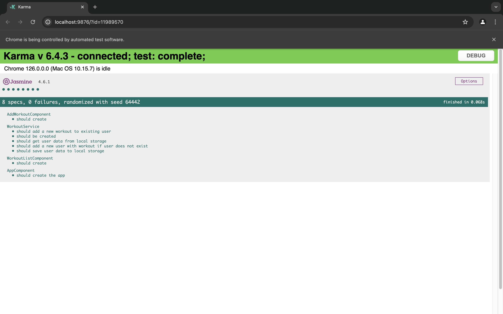
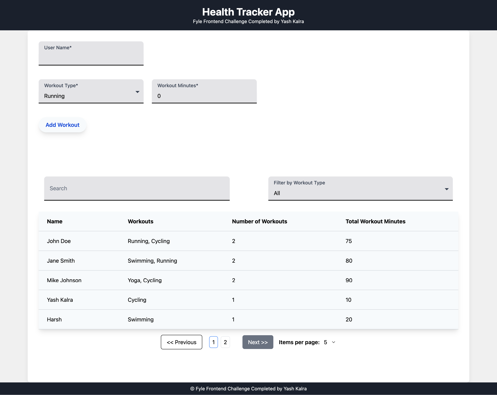

# Health Challenge Tracker

## Project Overview

This project is a Health Challenge Tracker designed as a single-page application (SPA) using Angular 14+. The application allows users to add their workout details, search and filter workouts, and view progress using charts.

## Features

- Add User: Input fields to add user name, workout type, and workout minutes.
- Display Users: Users added are displayed in a table grid.
- Search and Filter: Option to search by username and filter by workout type.
- Local Storage: Data is stored using `localStorage`.
- Initial Data: The application starts with 3 users added by default.
- Pagination: Pagination is added for more than 5 users.
- Unit Testing: Contains unit tests for 1 component and 1 service with 100% code coverage.

## Technologies Used

- Angular 14+
- Tailwind CSS
- Local Storage for data persistence
- Vercel for Hosting

## Installation

1. Clone the repository:
   ```bash
   git clone <https://github.com/Yashkalra12/Fyle-Frontend-Dev-Challenge>
   cd <Fyle-Frontend-Dev-Challenge>
   ```

2. Install dependencies:
   ```bash
   npm install
   ```

3. Run the application:
   ```bash
   ng serve
   ```

4. Open your browser and navigate to `http://localhost:4200`.

## Usage

1. Add a user by entering the user name, workout type, and workout minutes, then click the 'Add' button.
2. View the list of users in the table grid.
3. Use the search bar to find users by name.
4. Use the filter to view workouts by type.
5. Navigate through pages if there are more than 5 users.

## Assumptions

- The initial data contains 3 users for demonstration purposes.
- Users can add multiple workouts with different types and durations.
- Pagination is implemented for user lists exceeding 5 entries.

## Unit Testing

- Unit tests are provided for 1 component and 1 service with 100% code coverage.
- To run tests:
  ```bash
  ng test
  ```

- Code coverage report can be found in the `coverage` folder.

### Unit Test Coverage Report




## Deployment

The application is hosted on Vercel. You can access the live version here:   <fyle-frontend-dev-challenge-yash-kalra.vercel.app>


## Screenshot of Application




## Folder Structure

```
.
├── src
│   ├── app
│   │   ├── features
│   │   │   ├── components
│   │   │   │   ├── add-workout
│   │   │   │   ├── workout-list
│   │   │   ├── service
│   │   │   │   ├── workout.service.ts
│   │   ├── models
│   │   │   ├── user.model.ts
│   ├── assets
│   ├── styles
│   │   ├── tailwind.css
│   ├── environments
│   ├── index.html
│   ├── main.ts
│   ├── app.module.ts
├── angular.json
├── package.json
├── README.md

```

## Conclusion

This project was a challenging and enriching experience, helping me to improve my skills in Angular, Tailwind CSS, and unit testing. I am eager to apply these skills in a real-world scenario through this internship.


This project was generated with [Angular CLI](https://github.com/angular/angular-cli) version 18.1.0.

## Development server

Run `ng serve` for a dev server. Navigate to `http://localhost:4200/`. The application will automatically reload if you change any of the source files.

## Code scaffolding

Run `ng generate component component-name` to generate a new component. You can also use `ng generate directive|pipe|service|class|guard|interface|enum|module`.

## Build

Run `ng build` to build the project. The build artifacts will be stored in the `dist/` directory.

## Running unit tests

Run `ng test` to execute the unit tests via [Karma](https://karma-runner.github.io).

## Running end-to-end tests

Run `ng e2e` to execute the end-to-end tests via a platform of your choice. To use this command, you need to first add a package that implements end-to-end testing capabilities.

## Further help

To get more help on the Angular CLI use `ng help` or go check out the [Angular CLI Overview and Command Reference](https://angular.dev/tools/cli) page.
